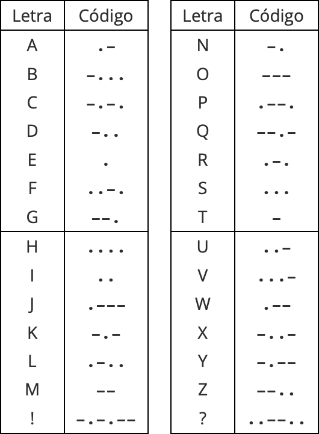
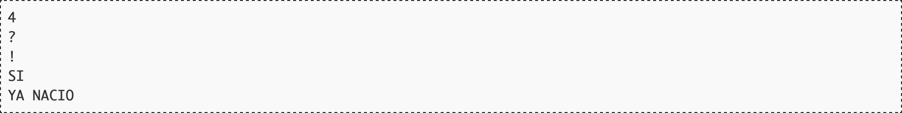

# El telegrama más corto

Aunque hoy su uso está en horas bajas, el sistema de telégrafo fue el medio principal de comunicación durante el final del siglo XIX y la primera mitad del XX [^time]. Para enviar letras y símbolos, se utilizaba código Morse, que codificaba cada elemento como una sucesión de puntos y rayas [^pdf]. Al menos esa es la creencia popular porque, en realidad, ambos son meros "pitidos" enviados por un cable con la característica de que el pitido asociado a una raya es tres veces más largo que el de un punto. Se conocen como puntos y rayas porque, en el receptor, esos pitidos ocasionaban perforaciones en una cinta de papel en movimiento, lo que originaba zonas rasgadas cortas (puntos) y largas (rayas).

	

El sistema era tan artesanal que el servicio se pagaba por número de palabras enviadas. Eso creó un lenguaje propio del telegrama, evitando palabras superfluas e incorporando abreviaturas particulares, como ocurriría mucho tiempo después con otras tecnologías como los SMS o Twitter.

Dice la leyenda que el telegrama más corto de la historia lo envió Victor Hugo. Pese a ser amante del subjuntivo, las frases subordinadas y los libros largos, cuando llegó el momento de preguntar por telegrama a su editor cómo estaban yendo las ventas de su recién publicado libro "Los miserables", decidió dejar su rimbombante prosa para otra ocasión y envió un simple "?".

Para saber si realmente Victor Hugo envió el telegrama más corto de la historia hay que recurrir a la foto finish. Su editor, a la vista de las buenas ventas del libro, le respondió con un simple "!".

## Entrada

La entrada comienza con un número indicando cuántos casos de prueba deberán ser procesados.

A continuación aparece una línea por cada caso de prueba, conteniendo una frase de no más de 80 letras mayúsculas del alfabeto inglés, signos de admiración e interrogación y espacios. Se garantiza que no aparecen dos espacios seguidos, y que la línea no empieza ni termina en espacio.

## Salida

Por cada caso de prueba el programa escribirá la duración en puntos del telegrama. Según la publicación de 1922 del estándar del código Morse, una raya dura tres puntos, entre símbolo y símbolo (raya o punto) de una misma letra hay que esperar un punto, la separación temporal entre letras son tres puntos, y la separación entre palabras cinco.

## Entrada de ejemplo

## Salida de ejemplo

## Lenguaje empleado

	

---

[🛜 Aquí puedes encontrar el sitio web oficial donde se encuentra este reto.](https://aceptaelreto.com/pub/problems/v006/37/st/statements/Spanish/index.html)

[^time]: Hoy en día, en muchos países el servicio de telégrafos, directamente ya no existe. En España se mantiene por su valor legal al dejar constancia de su envío y de su contenido, igual que los burofaxes.
[^pdf]: Esto ya tampoco es cierto. Hoy los "telegramas" son documentos PDF firmados digitalmente que viajan por redes de datos.